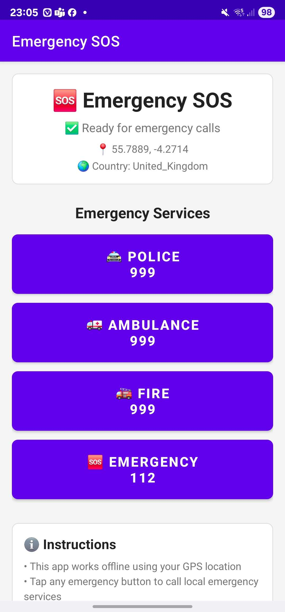

# 🆘 Emergency SOS Android App

A comprehensive offline emergency app that provides location-based emergency contact numbers and direct calling functionality.



## Features

- **🌍 Offline Functionality**: Works without internet connection using GPS coordinates
- **📍 Location-Based Detection**: Automatically detects your country from GPS coordinates  
- **📞 Direct Emergency Calling**: One-tap calling to local emergency services
- **🗺️ Comprehensive Database**: Emergency numbers for 70+ countries worldwide
- **🚔 Multiple Services**: Police, Ambulance, Fire Department, and General Emergency
- **⚡ Real-time Updates**: Live location tracking and country detection
- **🔒 Secure & Private**: No data collection, works completely offline

## Screenshots

### Main Interface
- Clean, intuitive emergency interface
- Large, color-coded emergency buttons
- Real-time location and country display
- Status indicators for app readiness

### Emergency Services
- 🚔 **Police** (Blue) - Local police emergency number
- 🚑 **Ambulance** (Red) - Medical emergency services  
- 🚒 **Fire Department** (Orange) - Fire and rescue services
- 🆘 **General Emergency** (Green) - Universal emergency number

## Quick Start

### Prerequisites
- Android device with API level 21+ (Android 5.0+)
- GPS/Location services enabled
- Phone calling capability

### Installation Steps

1. **Clone the Repository**
   ```bash
   git clone https://github.com/ly2xxx/sos.git
   cd sos
   ```

2. **Open in Android Studio**
   - Open Android Studio
   - Select "Open an existing Android Studio project"
   - Navigate to the cloned repository folder
   - Click "OK" to open the project

3. **Build the Project**
   - Wait for Gradle sync to complete
   - Click Build → Make Project (Ctrl+F9)
   - Resolve any dependency issues if they arise

4. **Run on Device**
   - Connect your Android device via USB
   - Enable USB Debugging in Developer Options
   - Click Run → Run 'app' (Shift+F10)
   - Select your device and click OK

### Alternative: Install APK
1. Build APK: Build → Build Bundle(s)/APK(s) → Build APK(s)
2. Transfer APK to your Android device
3. Enable "Install from Unknown Sources" in Settings
4. Install the APK file

## How to Use

### First Launch
1. **Grant Permissions**: The app will request location and phone permissions
2. **Wait for Location**: Allow the app to detect your GPS coordinates
3. **Country Detection**: The app will automatically determine your country
4. **Ready to Use**: Emergency buttons will become active

### Making Emergency Calls
1. **Choose Service Type**: Tap the appropriate emergency button
   - Police (🚔) for crimes, violence, theft
   - Ambulance (🚑) for medical emergencies
   - Fire (🚒) for fires, accidents, rescue
   - General (🆘) for any emergency
2. **Confirm Call**: The app will immediately dial the emergency number
3. **Stay Calm**: Speak clearly with the emergency operator

### Offline Usage
- The app works completely offline once launched
- Emergency numbers are stored locally on your device
- GPS coordinates determine the appropriate country
- No internet connection required for core functionality

## Technical Details

### Architecture
- **MainActivity**: Core UI and emergency calling logic
- **LocationService**: GPS tracking and location management
- **CountryDetector**: Coordinate-to-country mapping
- **EmergencyContactsManager**: Emergency number database management
- **EmergencyContact**: Data model for emergency numbers

### Key Features
- **Offline Database**: 70+ countries with comprehensive emergency numbers
- **GPS Integration**: Real-time location tracking with minimal battery usage
- **Permission Handling**: Proper Android permission management
- **Error Handling**: Graceful fallbacks for missing data or services
- **Material Design**: Modern, accessible user interface

### Supported Countries
The app includes emergency numbers for major countries including:
- **North America**: USA, Canada, Mexico
- **Europe**: UK, Germany, France, Italy, Spain, Netherlands, and more
- **Asia**: China, Japan, India, South Korea, Thailand, Singapore, and more  
- **Oceania**: Australia, New Zealand
- **Africa**: South Africa, Egypt, Nigeria, Kenya, Ghana, and more
- **South America**: Brazil, Argentina, Chile, Colombia, and more

### Emergency Number Format
Each country includes:
- **Police**: Local police emergency number
- **Ambulance**: Medical emergency services
- **Fire**: Fire department and rescue services  
- **General**: Universal emergency number (where available)

## Development

### Project Structure
```
app/
├── src/main/
│   ├── java/com/ly2xxx/sos/
│   │   ├── MainActivity.java
│   │   ├── model/
│   │   │   └── EmergencyContact.java
│   │   ├── service/
│   │   │   └── LocationService.java
│   │   ├── util/
│   │   │   ├── CountryDetector.java
│   │   │   └── EmergencyContactsManager.java
│   │   └── receiver/
│   │       └── EmergencyReceiver.java
│   ├── res/
│   │   ├── layout/
│   │   │   └── activity_main.xml
│   │   ├── drawable/
│   │   ├── values/
│   │   └── assets/
│   │       └── emergency_contacts.json
│   └── AndroidManifest.xml
├── build.gradle
└── proguard-rules.pro
```

### Key Technologies
- **Android SDK**: Native Android development
- **Location Services**: GPS and Network location providers
- **JSON**: Emergency contacts database format
- **Material Design**: Modern UI components
- **Gradle**: Build system and dependency management

### Building from Source
```bash
# Clone repository
git clone https://github.com/ly2xxx/sos.git
cd sos

# Build with Gradle (if you have Android SDK)
./gradlew assembleDebug

# Output APK will be in: app/build/outputs/apk/debug/
```

## Permissions Required

### Essential Permissions
- **ACCESS_FINE_LOCATION**: GPS coordinates for country detection
- **ACCESS_COARSE_LOCATION**: Network-based location fallback
- **CALL_PHONE**: Direct emergency calling functionality

### Additional Permissions
- **INTERNET**: For enhanced location services (optional)
- **ACCESS_NETWORK_STATE**: Network connectivity detection
- **VIBRATE**: Haptic feedback for emergency actions
- **WAKE_LOCK**: Keep screen active during emergency

## Privacy & Security

### Data Privacy
- **No Data Collection**: The app doesn't collect or transmit user data
- **Offline Operation**: All data stored locally on device
- **No Analytics**: No tracking or analytics services
- **No Network Calls**: Emergency database works offline

### Security Features
- **Local Storage**: Emergency numbers stored in app assets
- **Permission Control**: User controls all permissions
- **No External Dependencies**: Minimal third-party libraries
- **Emergency Focus**: Designed specifically for emergency use

## Troubleshooting

### Common Issues

**App doesn't detect location:**
- Ensure GPS is enabled in device settings
- Grant location permissions to the app
- Try moving to an open area for better GPS signal
- Restart the app if location services were just enabled

**Emergency buttons are disabled:**
- Wait for location detection to complete
- Check that all required permissions are granted
- Ensure device has phone calling capability
- Restart the app if country detection fails

**Wrong country detected:**
- GPS accuracy can vary by location and conditions
- The app uses simplified country boundaries
- Border areas may show neighboring countries
- Manual verification of emergency numbers is recommended

**Call doesn't connect:**
- Verify the device has cellular service
- Some emergency numbers may not work from all carriers
- Emergency numbers are based on official sources but may change
- Try the general emergency number (usually 112 or 911)

### Getting Help
- Check device location settings
- Verify app permissions in device settings
- Ensure device has phone service
- Contact local emergency services for number verification

## Contributing

### How to Contribute
1. Fork the repository
2. Create a feature branch
3. Make your changes
4. Test thoroughly
5. Submit a pull request

### Areas for Contribution
- **Emergency Database**: Add or update emergency numbers
- **Country Detection**: Improve coordinate-to-country mapping
- **UI/UX**: Enhance user interface and accessibility
- **Testing**: Add automated tests and validation
- **Documentation**: Improve setup and usage instructions

### Emergency Numbers Database
The emergency numbers are stored in `app/src/main/assets/emergency_contacts.json`. To update:
1. Verify numbers with official government sources
2. Follow the existing JSON format
3. Test the changes thoroughly
4. Include source references in pull request

## License

This project is licensed under the MIT License - see the [LICENSE](LICENSE) file for details.

## Disclaimer

**⚠️ IMPORTANT EMERGENCY DISCLAIMER**

- This app is provided as-is for emergency preparedness
- Emergency numbers are based on publicly available information
- Numbers may change without notice - verify with local authorities  
- Always test emergency numbers in your area before relying on them
- In a real emergency, also try local operator assistance
- The developers are not responsible for outdated or incorrect emergency numbers
- This app should supplement, not replace, knowledge of local emergency procedures

## Contact

- **Repository**: https://github.com/ly2xxx/sos
- **Issues**: https://github.com/ly2xxx/sos/issues
- **Developer**: ly2xxx

---

**🆘 Stay Safe - Be Prepared - Know Your Emergency Numbers**